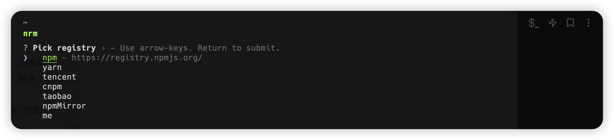
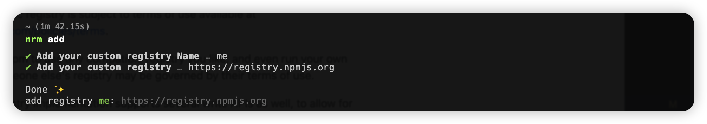

# Install

```bash
npm install -g @debbl/nrm
```

# Usage

## Select registry

```bash
nrm
```



## Add registry

```bash
nrm add
```



# Todo
- [ ] ls 
- [ ] current
- [ ] add
- [ ] del
- [x] del <registry>
- [x] rename

# Credit

[nrm](https://github.com/Pana/nrm)
